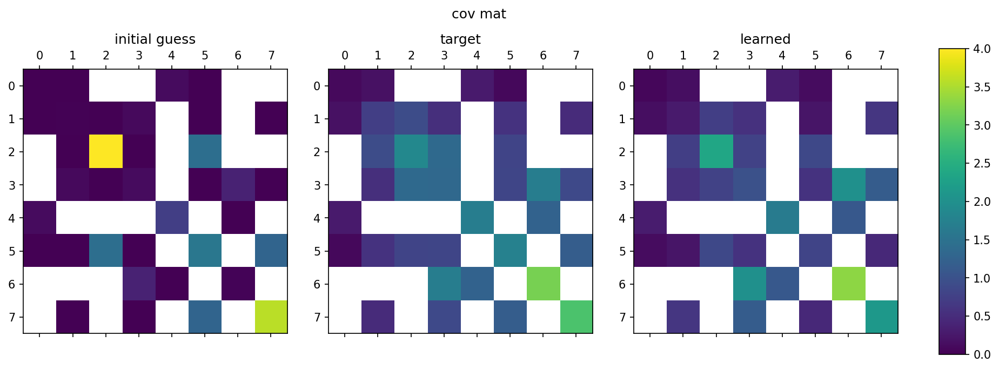
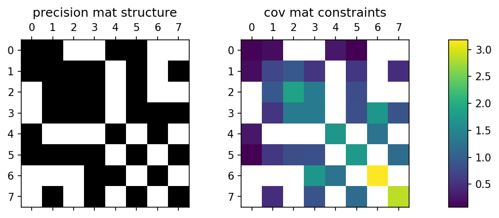
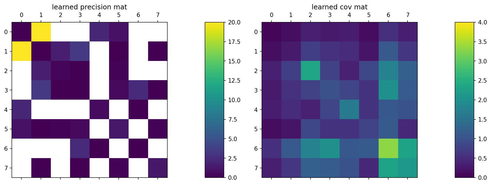

# tfConstrainedGauss: TensorFlow package for estimating constrained precision matrices

[](https://github.com/smrfeld/tf-constrained-gauss/actions/workflows/tests_and_docs.yml)

This is the source repo. for the `tfConstrainedGauss` Python package. It is a TensorFlow package for finding the interactions in a Gaussian graphical model with given and fixed structure from constraints on the precision matrix.

A detailed write up is below in the [about](#about) section, or can also be found in the [PDF in the `latex` folder](latex/constrained_gauss.pdf).



See the [examples directory](examples/) for an explanation of this image.

## Quickstart

1. Install:
    ```
    pip install tfConstrainedGauss
    ```

2. See the [example notebook](example/main.ipynb).

3. Read the [documentation](https://smrfeld.github.io/tf-constrained-gauss).

## Requirements

* `TensorFlow 2.5.0` or later. *Note: later versions not tested.*
* `Python 3.7.4` or later.

## Installation

Use `pip`:
```
pip install tfConstrainedGauss
```
Alternatively, clone this repo. and use the provided `setup.py`:
```
pip install .
```

## Documentation

See the dedicated [documentation page](https://smrfeld.github.io/tf-constrained-gauss).

## Example

See the notebooks in the [example directory](examples/).

## Tests

Tests are run using `pytest` and are located in [tests](tests/).

## About

This repo. implements a TensorFlow package for finding the interactions in a Gaussian graphical model with given and fixed structure from constraints on the precision matrix.

A detailed write up can also be found in the [PDF in the `latex` folder](latex/constrained_gauss.pdf).

### Identity-based method

Given an `n x n` covariance matrix, here of size `n=3`:
```
C = (
    c11 c12 c13
    c12 c22 c23
    c13 c23 c33
)
```
and given the structure of the precision matrix (i.e. given the Gaussian graphical model), for example:
```
P = (
    p11 p12 0
    p12 p22 p23
    0   p23 p33
)
```
(note that the diagonal elements are always non-zero), the goal is to find the elements of the precision matrix by:
```
P* = argmin | P.C - I|
```
where `I` is the identity.

The advantage of this approach is that it does not require calculating the inverse of any matrix, particularly important for large `n`.

The disadvantage of this approach is that the solution found for `P` may not yield a covariance matrix `P^{-1}` whose individual elements are close to those of `C`. That is, while `P.C` may be close to the identity, there are likely errors in every single element of `P^{-1}`.

### MaxEnt-based method

Given the structure of the `n x n` precision matrix (i.e. given the Gaussian graphical model), for example:
```
P = (
    p11 p12 0
    p12 p22 p23
    0   p23 p33
)
```
(note that the diagonal elements are always non-zero), and given the covariances for corresponding to every **non-zero** entry in `P`, i.e. given:
```
c11, c12, c22, c23, c33
```
the goal is to find the elements of `P`. In other words, every unique element `(i,j)` of the `n x n` symmetric matrix has a given constraint, either to a value in the covariance matrix, or a zero entry in the precision matrix.

Example:


This is a maximum entropy (MaxEnt) setup. The elements of the precision matrix `pij` are directly the interactions in the Gaussian graphical model; the moments they control in a MaxEnt sense are the covariances `cij`.

The problem can be solved in a number of ways, for example using Boltzmann machine learning, where we minimize:
```
P* = argmin DKL = argmin \sum_n p(n) [ \ln p(n) / q(n) ]
```
where `p(n)` is the (unknown) data distribution that gave rise to the given covariances `cij` and `q(n)` is the Gaussian with precision matrix `P`. The gradients that result are the wake sleep phase:
```
Delta pij ~ cij - (P^{-1})_{ij}
```
In TensorFlow, we minimize the MSE loss for the individual terms, which results in the same first order gradients:
```
P* = argmin \sum_{ij} || cij - (P^{-1})_{ij} ||_2
```

Example:




To learn each element of the covariance matrix with equal importance, we can use a weighted MSE loss:
```
P* = argmin \sum_{ij} wij || cij - (P^{-1})_{ij} ||_2
```
where
```
wij = 1 / cij^2
```

A detailed write up can also be found in the [PDF in the `latex` folder](latex/constrained_gauss.pdf).
