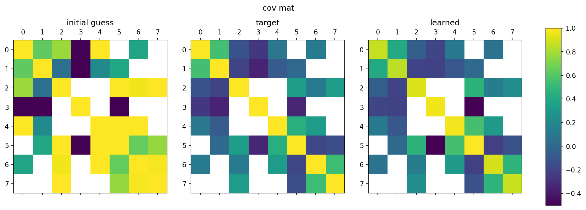

.. tfConstrainedGauss documentation master file, created by
   sphinx-quickstart on Thu Jun 17 14:20:48 2021.
   You can adapt this file completely to your liking, but it should at least
   contain the root `toctree` directive.

Estimating constrained precision matrices using TensorFlow
==========================================================

This is the source repo. for the `tfConstrainedGauss Python package <https://github.com/smrfeld/tf-constrained-gauss>`_. 

It is a TensorFlow package for finding the interactions in a Gaussian graphical model with given and fixed structure from constraints on the precision matrix.

A detailed write up can be found in the `PDF in the latex folder <https://github.com/smrfeld/tf-constrained-gauss/blob/main/latex/constrained_gauss.pdf>`_.

Quickstart
==========

1. Install:

.. code-block:: python

   pip install tfConstrainedGauss
    
2. See the example notebooks in the example folder of the `GitHub repo <https://github.com/smrfeld/tf-constrained-gauss>`_.

3. Scan the :ref:`api_ref`.

Requirements
============

* `TensorFlow 2.5.0` or later. *Note: later versions not tested.*
* `Python 3.7.4` or later.

Installation
============

Either: use `pip`:

.. code-block:: python

   pip install tfConstrainedGauss

Or alternatively, clone this `repo. from GitHub <https://github.com/smrfeld/tf-constrained-gauss>`_ and use the provided `setup.py`:

.. code-block:: python

   pip install .

API Documentation
=================

See the :ref:`api_ref`.

Examples
========

See the notebooks in the examples directory in `GitHub repo. <https://github.com/smrfeld/tf-constrained-gauss>`_

Indices and tables
==================

* :ref:`genindex`
* :ref:`modindex`
* :ref:`search`

Contents
========

.. toctree::
   :maxdepth: 2
   :caption: Contents:

   quickstart.md
   modules.rst