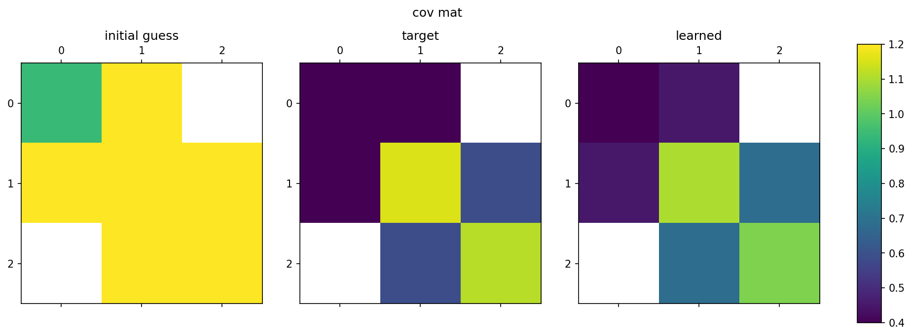
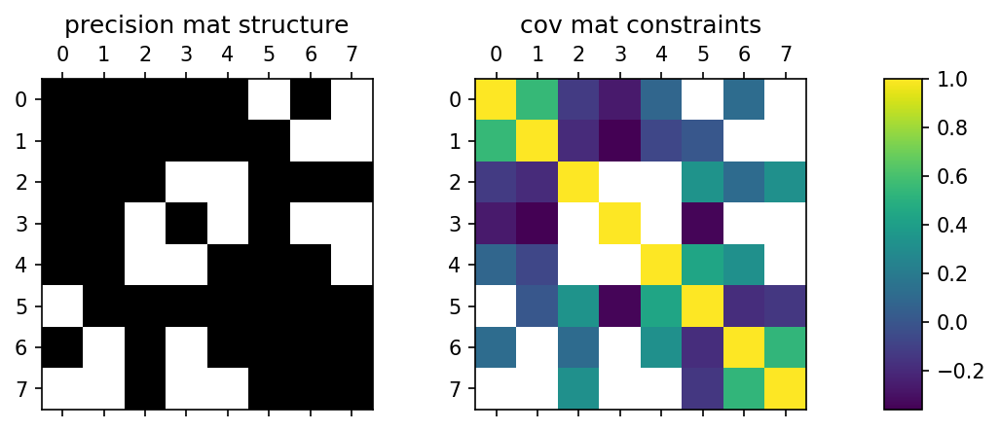
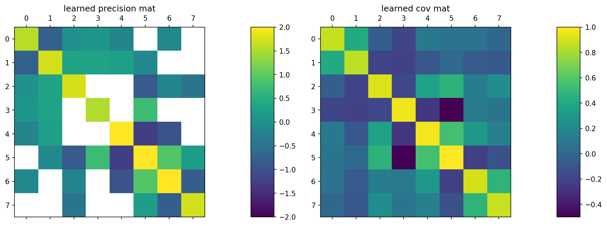

# Examples for tfConstrainedGauss

These are example notebooks for the `tfConstrainedGauss` package.

* [example_n3.ipynb](example_n3.ipynb) is a simple example for the MaxEnt-based solution for a `3x3` matrix.
* [example_n8.ipynb](example_n8.ipynb) is a larger example for the MaxEnt-based solution for a `8x8` matrix.

## 3x3 MaxEnt-based example

* Left: precision matrix structure, where white indicates zero elements.
* Right: covariance matrix constraints.

* Left: initial starting guess for the algorithm.
* Middle: target covariance matrix constraints.
* Right: Learned constraints after solving.

* Left: learned precision matrix.
* Right: full learned covariance matrix (inverse of left), including elements such as `(0,2)` which are constrained by the precision (rather than covariance) matrix.

## 8x8 MaxEnt-based example

* Left: precision matrix structure, where white indicates zero elements.
* Right: covariance matrix constraints.

* Left: initial starting guess for the algorithm.
* Middle: target covariance matrix constraints.
* Right: Learned constraints after solving.

* Left: learned precision matrix.
* Right: full learned covariance matrix (inverse of left), including elements such as `(0,7)` which are constrained by the precision (rather than covariance) matrix.